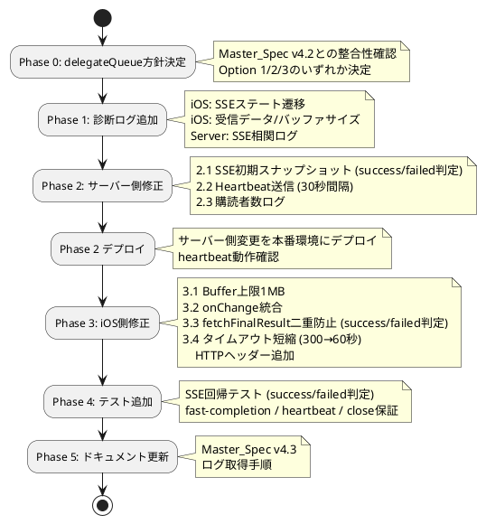

# Phase B Refactor-8: メモリ暴走・UI凍結 根本原因修正計画（最終版）

作成日: 2025-11-23
レビュアー: Codex (初回 + 追補 + ギャップ修正)
前版: v6
バージョン: **FINAL**

## ドキュメント管理

**このドキュメントが最終実装計画です。**
- v1-v6は開発履歴として保持
- 実装時はこのFINAL版を参照

## エグゼクティブサマリー

### 確定した根本原因

#### 主原因A: 高速完了レース（最重要）
**現象:**
```
DEBUG: SSEManager - didReceive response, statusCode: 200
DEBUG: urlSession(didCompleteWithError:) called - error: nil
[didReceive data が一度も呼ばれない]
```

**根拠:**
- サーバー: `/jobs/{id}/stream` (main.py:547-568) は購読開始時にジョブ状態スナップショットを送信しない
- ジョブが瞬時完了すると `_broadcast_job_event()` → `close()` が購読前に終了
- クライアントがSSE接続した時点で既にストリーム終了済み → HTTPヘッダのみ受信して即完了

**重要:** サーバーの終端ステータスは **`"success"`** と **`"failed"`** （`"completed"` ではない）

#### 主原因B: キープアライブ欠如（重要）
**根拠:**
- サーバー: heartbeat/ping イベント送信なし
- iOS: `timeoutIntervalForRequest=300` のみ（5分）
- ネットワーク/プロキシによる早期切断で `didReceive data` 未到達

### 実装順序（重要）

**Phase 2（サーバー側）完了 → Phase 3（iOS側）の順番厳守:**
1. Phase 2.1: SSE初期スナップショット実装
2. Phase 2.2: Heartbeat実装（30秒間隔）
3. **Phase 2デプロイ完了後**
4. Phase 3.4: iOS側タイムアウト短縮（300→60秒）

**理由:** heartbeat未実装の状態でタイムアウトを60秒に短縮すると、長時間ジョブで早期切断が発生

---

## Phase 0: 事前確認

### 0.1 Master_Spec v4.2 確認と方針決定
**delegateQueue方針決定が必須:**

Master_Spec v4.2 (15.2節) では以下を要求:
```
iOS SSEManager の delegateQueue を .main に明示的に設定
```

しかし現行コードは:
```swift
session = URLSession(configuration: config, delegate: self, delegateQueue: nil)  // システムBG
```

**決定が必要:**
- [ ] **Option 1**: Master_Spec v4.2に従い `.main` に変更
- [ ] **Option 2**: `nil` (システムBG) を継続、Master_Spec v4.3で仕様を現実装に合わせる
- [ ] **Option 3**: serial `OperationQueue` を採用、Master_Spec v4.3で仕様追加

**完了条件:** 方針決定とドキュメント更新

### 0.2 現行メモリ挙動再計測
- [ ] 現行バイナリで1回目/2回目送信時のRSS計測
- [ ] Logs/memory_snapshot_comparison.md に追記

---

## Phase 1: 診断強化（P0 - Observability）

### 1.1 iOS SSEステート遷移ログ（P0-Critical-A）
**対象ファイル:** `iOS_WatchOS/RemotePrompt/RemotePrompt/Services/SSEManager.swift`

**実装内容:**
```swift
// SSEState enum追加
enum SSEState: String {
    case idle = "idle"
    case connecting = "connecting"
    case responseReceived = "responseReceived"  // didReceive response後
    case receiving = "receiving"                 // didReceive data開始
    case success = "success"                     // 成功完了
    case failed = "failed"                       // 失敗完了
    case disconnected = "disconnected"
}

private var sseState: SSEState = .idle {
    didSet {
        let thread = Thread.isMainThread ? "main" : "bg"
        print("DEBUG: [SSE-STATE] \(oldValue.rawValue) → \(sseState.rawValue) [thread:\(thread)] job=\(jobId ?? "nil")")
    }
}
```

**状態遷移:**
- `connect()`: idle → connecting
- `didReceive response`: connecting → responseReceived
- `didReceive data` 初回: responseReceived → receiving
- `didCompleteWithError` (error=nil): * → success
- `didCompleteWithError` (error≠nil): * → failed
- `disconnect()`: * → disconnected → idle

**チェックリスト:**
- [ ] SSEState enum定義（success/failedに修正）
- [ ] sseState プロパティ追加（didSetでログ出力）
- [ ] connect()に状態遷移追加（idle → connecting）
- [ ] didReceive response に状態遷移追加（connecting → responseReceived）
- [ ] didReceive data に状態遷移追加（responseReceived → receiving）
- [ ] didCompleteWithError に状態遷移追加（→ success/failed）
- [ ] disconnect()に状態遷移追加（→ disconnected → idle）

**完了条件:** フリーズ時のログに `responseReceived → success` パターンが記録される（receiving未到達を証明）

### 1.2 iOS受信データ/バッファサイズログ（P0）
**対象ファイル:** `iOS_WatchOS/RemotePrompt/RemotePrompt/Services/SSEManager.swift:89-129`

**実装内容:**
```swift
func urlSession(_ session: URLSession, dataTask: URLSessionDataTask, didReceive data: Data) {
    let thread = Thread.isMainThread ? "main" : "bg"
    print("DEBUG: [SSE-DATA] received: \(data.count) bytes, bufferSize: \(buffer.count) bytes [thread:\(thread)]")

    // Phase 3.1 Buffer上限チェック（後述）
    // ...

    buffer.append(data)

    guard let chunk = String(data: buffer, encoding: .utf8) else {
        print("DEBUG: [SSE-DATA] Failed to decode buffer as UTF-8")
        return
    }

    let events = chunk.components(separatedBy: "\n\n")
    print("DEBUG: [SSE-EVENTS] parsed \(events.count) event blocks from buffer")

    for index in 0..<(events.count - 1) {
        // ... イベント処理 ...

        if let event = try? JSONDecoder().decode(JobStatusEvent.self, from: jsonData) {
            print("DEBUG: [SSE-DECODE] SUCCESS - status: \(event.status)")
            DispatchQueue.main.async {
                self.jobStatus = event.status
            }
        } else {
            print("DEBUG: [SSE-DECODE] FAILED - payload: \(dataPayload)")
        }
    }

    // buffer処理
    if let trailing = events.last, !trailing.isEmpty {
        buffer = Data(trailing.utf8)
    } else {
        buffer.removeAll()
    }
}
```

**チェックリスト:**
- [ ] didReceive data に受信バイト数ログ追加
- [ ] buffer.count ログ追加
- [ ] UTF-8デコード失敗ログ追加
- [ ] イベントパース数ログ追加
- [ ] JSONデコード成功/失敗ログ追加

**完了条件:** buffer増加パターンとデコード失敗箇所を可視化

### 1.3 サーバーSSE相関ログ（P0-Server）
**対象ファイル:** `remote-job-server/sse_manager.py`

**実装内容:**
```python
async def subscribe(self, job_id: str) -> AsyncGenerator[str, None]:
    """Register an SSE subscriber for the specified job."""
    current_loop = asyncio.get_running_loop()
    if self._loop is None or self._loop.is_closed():
        self._loop = current_loop

    queue: asyncio.Queue = asyncio.Queue()
    self._connections.setdefault(job_id, set()).add(queue)

    # 購読開始ログ
    subscribers_count = len(self._connections[job_id])
    LOGGER.info("[SSE-SUBSCRIBE] job_id=%s, subscribers=%d", job_id, subscribers_count)

    try:
        while True:
            # Phase 2.2でheartbeat追加（後述）
            payload = await queue.get()

            if payload is None:
                LOGGER.info("[SSE-CLOSE] job_id=%s, received None, closing stream", job_id)
                break

            LOGGER.debug("[SSE-SEND] job_id=%s, payload_keys=%s", job_id, list(payload.keys()))
            yield f"data: {json.dumps(payload)}\n\n"
    finally:
        if job_id in self._connections:
            self._connections[job_id].discard(queue)
            if not self._connections[job_id]:
                del self._connections[job_id]
        remaining = len(self._connections.get(job_id, []))
        LOGGER.info("[SSE-CLEANUP] job_id=%s, remaining_subscribers=%d", job_id, remaining)
```

**チェックリスト:**
- [ ] subscribe開始時にsubscribers数ログ追加
- [ ] イベント送信時にpayload keysログ追加（DEBUGレベル）
- [ ] None受信時のcloseログ追加
- [ ] cleanup時の残存subscribers数ログ追加

**完了条件:** クライアント未受信時のサーバー側タイムラインを復元可能

---

## Phase 2: サーバー側根本修正（P0-Critical）

### 2.1 SSE初期スナップショット送信（P0-Critical - 高速完了レース解消）
**対象ファイル:** `remote-job-server/main.py:547-568` (`/jobs/{id}/stream`)

**重要な修正点:**
- ステータスは **`"success"`** と **`"failed"`** （`"completed"` ではない）
- `job_manager.get_job()` は同期関数（`await` 不要）

**実装内容:**
```python
@app.get("/jobs/{job_id}/stream", dependencies=[Depends(verify_api_key)])
async def stream_job_status(job_id: str, request: Request) -> StreamingResponse:
    """Stream job status updates via Server-Sent Events with initial snapshot."""

    async def event_generator():
        # 【追加】初期スナップショット送信（同期get_job使用）
        job_dict = job_manager.get_job(job_id)  # 同期関数、await不要
        if job_dict:
            # 初期イベントを即座送信
            initial_payload = {
                "status": job_dict["status"],  # "queued", "running", "success", "failed"
                "started_at": job_dict.get("started_at"),
                "finished_at": job_dict.get("finished_at"),
                "exit_code": job_dict.get("exit_code")
            }
            # SSEフォーマットで送信
            yield f"data: {json.dumps(initial_payload)}\n\n"
            LOGGER.info("[SSE-INITIAL] job_id=%s, sent snapshot status=%s", job_id, job_dict["status"])

            # 【修正】終端判定: "success" または "failed"
            if job_dict["status"] in ["success", "failed"]:
                LOGGER.info("[SSE-INITIAL] job_id=%s, terminal state, closing stream immediately", job_id)
                return  # ストリーム即終了

        # 【既存】通常のストリーミング
        try:
            async for message in sse_manager.subscribe(job_id):
                if await request.is_disconnected():
                    LOGGER.info("Client disconnected during SSE stream for job %s", job_id)
                    break
                yield message  # sse_manager.subscribeが既に "data: ...\n\n" フォーマット済み
        finally:
            LOGGER.info("SSE event_generator completed for job %s", job_id)

    # 【既存】ヘッダーは重複なし
    return StreamingResponse(
        event_generator(),
        media_type="text/event-stream",
        headers={
            "Cache-Control": "no-cache",
            "X-Accel-Buffering": "no",
        },
    )
```

**チェックリスト:**
- [ ] `job_manager.get_job(job_id)` で同期取得（await不使用）
- [ ] job存在確認
- [ ] **初期ペイロード生成（status, started_at, finished_at, exit_code）**
- [ ] **初期ペイロードのフィールドが `job_manager.get_job()` の返却構造と一致することを確認**
- [ ] **初期ペイロードのフィールドが `_broadcast_job_event()` と同一キーであることを確認**
- [ ] `data: {json}\n\n` フォーマットで初期イベント送信
- [ ] **終端判定を `status in ["success", "failed"]` に修正**
- [ ] ログ追加（初期送信、終端即終了）
- [ ] 既存ヘッダーは維持（重複追加しない）

**完了条件:**
- 高速完了ジョブ（status="success"）でもクライアントが必ず1件以上のイベント受信
- ログに `[SSE-INITIAL] job_id=..., sent snapshot status=success` 記録確認
- **初期スナップショットのフィールド（status/started_at/finished_at/exit_code）が `_broadcast_job_event()` と同一**

### 2.2 Heartbeat送信（P0-Critical - キープアライブ）
**対象ファイル:** `remote-job-server/sse_manager.py`

**実装内容:**
```python
async def subscribe(self, job_id: str) -> AsyncGenerator[str, None]:
    """Subscribe to job events with heartbeat support (30s interval)"""
    current_loop = asyncio.get_running_loop()
    if self._loop is None or self._loop.is_closed():
        self._loop = current_loop

    queue: asyncio.Queue = asyncio.Queue()
    self._connections.setdefault(job_id, set()).add(queue)

    subscribers_count = len(self._connections[job_id])
    LOGGER.info("[SSE-SUBSCRIBE] job_id=%s, subscribers=%d", job_id, subscribers_count)

    HEARTBEAT_INTERVAL = 30.0  # 30秒

    try:
        while True:
            try:
                # タイムアウト付きでイベント待機
                payload = await asyncio.wait_for(queue.get(), timeout=HEARTBEAT_INTERVAL)

                if payload is None:
                    LOGGER.info("[SSE-CLOSE] job_id=%s, received None, closing stream", job_id)
                    break

                # payloadはdict（_broadcast_job_eventから送られる）
                LOGGER.debug("[SSE-SEND] job_id=%s, payload_keys=%s", job_id, list(payload.keys()))
                yield f"data: {json.dumps(payload)}\n\n"

            except asyncio.TimeoutError:
                # Heartbeat送信（SSEコメント形式）
                LOGGER.debug("[SSE-HEARTBEAT] job_id=%s", job_id)
                yield ":heartbeat\n\n"  # SSEコメント（クライアントで無視される）

    finally:
        if job_id in self._connections:
            self._connections[job_id].discard(queue)
            if not self._connections[job_id]:
                del self._connections[job_id]
        remaining = len(self._connections.get(job_id, []))
        LOGGER.info("[SSE-CLEANUP] job_id=%s, remaining_subscribers=%d", job_id, remaining)
```

**チェックリスト:**
- [ ] HEARTBEAT_INTERVAL定数定義（30.0秒）
- [ ] `asyncio.wait_for(queue.get(), timeout=HEARTBEAT_INTERVAL)` 実装
- [ ] TimeoutError時に `:heartbeat\n\n` 送信（SSEコメント形式）
- [ ] payloadはdictのまま受け取り、`data: {json}\n\n` に変換
- [ ] ログ追加（heartbeat送信）

**完了条件:**
- 30秒ごとに `:heartbeat\n\n` 送信確認（サーバーログ）
- クライアントログで heartbeat 受信確認（didReceive data に記録される）

### 2.3 購読者数ログとclose保証（P1-Server）
**対象ファイル:** `remote-job-server/job_manager.py`

**実装内容:**
```python
def _broadcast_job_event(
    self,
    job_id: str,
    payload: dict,
    *,
    close_stream: bool = False,
) -> None:
    if not self.sse_manager:
        LOGGER.warning("SSE manager not configured, skipping broadcast for job %s", job_id)
        return

    # 【追加】購読者数ログ
    subscribers = len(self.sse_manager._connections.get(job_id, []))
    LOGGER.info("Broadcasting SSE event for job %s: %s (subscribers=%d, close_stream=%s)",
                job_id, payload, subscribers, close_stream)

    async def _runner() -> None:
        await self.sse_manager.broadcast(job_id, payload)
        if close_stream:
            LOGGER.info("[BROADCAST-CLOSE] job_id=%s, closing stream", job_id)
            await self.sse_manager.close(job_id)

    self._run_async(_runner())
```

**チェックリスト:**
- [ ] broadcast前にsubscribers数取得
- [ ] ログにsubscribers数追加
- [ ] close_stream=True時の明示的ログ追加

**完了条件:** ログで購読者数と終了タイミングを追跡可能

---

## Phase 3: iOS側防御強化（P1-High）

**重要:** Phase 2（サーバー側heartbeat実装）完了後に実施

### 3.1 Buffer上限1MB（P1-High）
**対象ファイル:** `iOS_WatchOS/RemotePrompt/RemotePrompt/Services/SSEManager.swift:89-129`

**実装内容:**
```swift
private let MAX_BUFFER_SIZE = 1_048_576  // 1MB

func urlSession(_ session: URLSession, dataTask: URLSessionDataTask, didReceive data: Data) {
    let thread = Thread.isMainThread ? "main" : "bg"
    print("DEBUG: [SSE-DATA] received: \(data.count) bytes, bufferSize: \(buffer.count) bytes [thread:\(thread)]")

    // 【追加】Buffer上限チェック
    if buffer.count + data.count > MAX_BUFFER_SIZE {
        print("DEBUG: [SSE-BUFFER] LIMIT EXCEEDED! current=\(buffer.count) incoming=\(data.count) max=\(MAX_BUFFER_SIZE)")
        print("DEBUG: [SSE-BUFFER] Clearing buffer and discarding incoming data")
        buffer.removeAll()
        // イベント境界を失うが、メモリ暴走を優先回避
        // サーバー側heartbeatで接続維持、次回イベントで再同期
        return
    }

    buffer.append(data)

    // ... 既存イベント処理 ...
}
```

**チェックリスト:**
- [ ] MAX_BUFFER_SIZE定数定義（1_048_576 = 1MB）
- [ ] `buffer.count + data.count > MAX_BUFFER_SIZE` チェック
- [ ] 超過時に `buffer.removeAll()`
- [ ] 超過時のログ出力（LIMIT EXCEEDED, Clearing buffer）
- [ ] 超過時は早期return（データ破棄）

**完了条件:**
- 1MB超過でbuffer強制クリア確認
- ログに `[SSE-BUFFER] LIMIT EXCEEDED` 記録

### 3.2 onChange統合（P1-High）
**対象ファイル:** `iOS_WatchOS/RemotePrompt/RemotePrompt/Views/ChatView.swift`

**実装前に現状確認:**
- [ ] ChatView.swiftを読み、現在のonChange実装を確認

**実装内容（想定）:**
```swift
// 【修正前】2系統のonChange（想定）
// .onChange(of: viewModel.messages.count) { ... }
// .onChange(of: viewModel.messages.map { ($0.content, $0.status) }) { ... }

// 【修正後】ID差分のみ監視
ScrollViewReader { proxy in
    ScrollView {
        // ... メッセージ表示 ...
    }
    .onChange(of: viewModel.messages.map { $0.id }) { newIds in
        print("DEBUG: [VIEW-ONCHANGE] message IDs changed, count: \(newIds.count)")

        // 最新メッセージへスクロール
        if let lastId = newIds.last {
            withAnimation {
                proxy.scrollTo(lastId, anchor: .bottom)
            }
        }
    }
}
```

**チェックリスト:**
- [ ] 現在のonChange実装を確認（ChatView.swiftを読む）
- [ ] 既存の複数onChangeを削除
- [ ] ID配列のonChangeに統合
- [ ] ログ追加
- [ ] スクロール処理をID配列onChange内に移動

**完了条件:**
- onChange発火回数が大幅減少（ログ確認）
- UIスクロール動作は維持

### 3.3 fetchFinalResult二重実行防止（P1）
**対象ファイル:** `iOS_WatchOS/RemotePrompt/RemotePrompt/ViewModels/ChatViewModel.swift`

**実装内容:**
```swift
// クラスプロパティに追加
private var finalResultFetched: Set<String> = []  // ジョブIDセット

func startSSEStreaming(for jobId: String) {
    // ... SSEManager作成 ...

    // isConnected監視
    sseManager.$isConnected
        .sink { [weak self] isConnected in
            guard let self else { return }

            if !isConnected {
                print("DEBUG: [SSE-DISCONNECT] jobId=\(jobId), isConnected=false")

                // 【追加】二重実行防止
                guard !self.finalResultFetched.contains(jobId) else {
                    print("DEBUG: [SSE-DISCONNECT] jobId=\(jobId), already fetched, skipping")
                    return
                }
                self.finalResultFetched.insert(jobId)

                // 0.5秒待機後にfetchFinalResult
                DispatchQueue.main.asyncAfter(deadline: .now() + 0.5) {
                    Task {
                        await self.fetchFinalResult(jobId: jobId)
                        self.cleanupConnection(for: jobId)
                    }
                }
            }
        }
        .store(in: &sseCancellables)

    // jobStatus監視（終端状態）
    sseManager.$jobStatus
        .sink { [weak self] status in
            guard let self else { return }

            // 【修正】終端判定: "success" または "failed"
            if status == "success" || status == "failed" {
                print("DEBUG: [SSE-TERMINAL] jobId=\(jobId), terminal status=\(status)")

                // 【追加】二重実行防止
                guard !self.finalResultFetched.contains(jobId) else {
                    print("DEBUG: [SSE-TERMINAL] jobId=\(jobId), already fetched, skipping")
                    return
                }
                self.finalResultFetched.insert(jobId)

                Task {
                    await self.fetchFinalResult(jobId: jobId)
                    self.cleanupConnection(for: jobId)
                }
            }

            // 既存のステータス更新処理
            self.updateMessageStatus(messageId: jobId, status: status)
        }
        .store(in: &sseCancellables)
}

func cleanupConnection(for jobId: String) {
    // ... 既存cleanup ...

    // 【追加】完了後にフラグクリア
    finalResultFetched.remove(jobId)
    print("DEBUG: [CLEANUP] jobId=\(jobId), cleared finalResultFetched flag")
}
```

**チェックリスト:**
- [ ] `finalResultFetched: Set<String>` プロパティ追加
- [ ] `isConnected=false`トリガに二重実行チェック追加
- [ ] 実行前に `finalResultFetched.insert(jobId)`
- [ ] **`jobStatus` 終端判定を `"success"` または `"failed"` に修正**
- [ ] 終端状態トリガに二重実行チェック追加
- [ ] `cleanupConnection` 完了後に `finalResultFetched.remove(jobId)`
- [ ] 各所にログ追加

**完了条件:**
- ログで二重実行スキップ確認
- fetchFinalResult呼び出しが1回のみ

### 3.4 HTTPヘッダー調整とタイムアウト短縮（P1）
**対象ファイル:** `iOS_WatchOS/RemotePrompt/RemotePrompt/Services/SSEManager.swift`

**重要:** Phase 2.2（heartbeat実装）完了後に実施

**実装内容:**
```swift
func connect(jobId: String) {
    self.jobId = jobId

    // 既存のタスクがあればキャンセル
    task?.cancel()
    task = nil
    buffer.removeAll()

    // URLSession生成
    let config = URLSessionConfiguration.default

    // 【修正】タイムアウト短縮: 300 → 60（heartbeat 30s + 余裕30s）
    // 注意: サーバー側heartbeat実装完了後に適用すること
    config.timeoutIntervalForRequest = 60

    config.httpAdditionalHeaders = [
        "Accept": "text/event-stream",
        "Cache-Control": "no-cache",           // 【追加】
        "Accept-Encoding": "identity",         // 【追加】プロキシ圧縮回避
    ]

    // delegateQueue: Phase 0.1で決定した方針に従う
    // Option 1: .main
    // Option 2: nil (システムBG) - 現状維持
    // Option 3: serial OperationQueue
    session = URLSession(configuration: config, delegate: self, delegateQueue: nil)
    print("DEBUG: SSEManager.connect() - Created new URLSession for job: \(jobId)")

    guard let url = URL(string: "\(Constants.baseURL)/jobs/\(jobId)/stream") else {
        errorMessage = "無効なSSE URL"
        return
    }

    var request = URLRequest(url: url)
    request.httpMethod = "GET"
    request.setValue(Constants.apiKey, forHTTPHeaderField: "x-api-key")

    // リクエストレベルでもタイムアウト設定
    request.timeoutInterval = 60.0

    task = session?.dataTask(with: request)
    print("DEBUG: SSEManager.connect() - Starting data task for job: \(jobId)")
    task?.resume()

    DispatchQueue.main.async {
        self.isConnected = true
        print("DEBUG: SSEManager.connect() - isConnected set to true")
    }

    #if DEBUG && MEMORY_METRICS
    MemoryMetrics.logRSS("SSE connect", extra: "job=\(jobId)")
    #endif
}
```

**チェックリスト:**
- [ ] **Phase 2.2（heartbeat）実装完了確認**
- [ ] `config.timeoutIntervalForRequest = 60` に変更（300 → 60）
- [ ] `httpAdditionalHeaders` に `Cache-Control: no-cache` 追加
- [ ] `httpAdditionalHeaders` に `Accept-Encoding: identity` 追加
- [ ] `request.timeoutInterval = 60.0` 設定
- [ ] delegateQueueをPhase 0.1の決定に従って設定
- [ ] コメント追加（heartbeat間隔との関係、実装順序注意）

**完了条件:**
- サーバー側heartbeat実装完了後にデプロイ
- タイムアウト設定変更確認（60秒）
- HTTPヘッダー送信確認（サーバーログまたはCharles Proxy）

---

## Phase 4: サーバー側検証基盤（P2-Medium）

### 4.1 SSE回帰テスト追加
**対象ファイル:** `remote-job-server/tests/test_sse.py`（新規または既存拡張）

**実装内容:**
```python
import pytest
import asyncio
import json
from httpx import AsyncClient

@pytest.mark.asyncio
async def test_sse_fast_completion_initial_snapshot(async_client: AsyncClient):
    """Test SSE initial snapshot when job completes before subscription"""
    # ジョブ作成
    response = await async_client.post("/jobs", json={
        "runner": "codex",
        "input_text": "echo test",
        "device_id": "test-device",
        "room_id": "test-room",
    })
    assert response.status_code == 200
    job_id = response.json()["id"]

    # ジョブ完了を待機
    await asyncio.sleep(1.0)

    # SSE購読開始（完了後）
    events = []
    async with async_client.stream("GET", f"/jobs/{job_id}/stream") as stream_response:
        async for line in stream_response.aiter_lines():
            if line.startswith("data:"):
                data = line[5:].strip()
                events.append(json.loads(data))

                # 初期スナップショット受信後に終了（終端状態なら即終了）
                # 【修正】status判定: "success" または "failed"
                if events[0]["status"] in ["success", "failed"]:
                    break

    # 少なくとも1件の初期スナップショットイベント受信確認
    assert len(events) >= 1
    assert events[0]["status"] in ["success", "failed"]

    # 【追加】初期スナップショットのフィールド一致確認
    assert "status" in events[0]
    assert "started_at" in events[0]
    assert "finished_at" in events[0]
    assert "exit_code" in events[0]
    # フィールドが _broadcast_job_event と同一キーであることを確認


@pytest.mark.asyncio
async def test_sse_heartbeat(async_client: AsyncClient):
    """Test SSE heartbeat emission (30s interval)"""
    # 長時間ジョブ作成
    response = await async_client.post("/jobs", json={
        "runner": "codex",
        "input_text": "sleep 120",
        "device_id": "test-device",
        "room_id": "test-room",
    })
    assert response.status_code == 200
    job_id = response.json()["id"]

    heartbeat_count = 0
    start_time = asyncio.get_event_loop().time()

    async with async_client.stream("GET", f"/jobs/{job_id}/stream") as stream_response:
        async for line in stream_response.aiter_lines():
            if line.startswith(":heartbeat"):
                heartbeat_count += 1

            # 70秒経過で終了
            if asyncio.get_event_loop().time() - start_time > 70:
                break

    # 30秒間隔で少なくとも2回のheartbeat確認
    assert heartbeat_count >= 2


@pytest.mark.asyncio
async def test_sse_close_guarantee(async_client: AsyncClient):
    """Test SSE stream closes after job completion"""
    response = await async_client.post("/jobs", json={
        "runner": "codex",
        "input_text": "echo test",
        "device_id": "test-device",
        "room_id": "test-room",
    })
    assert response.status_code == 200
    job_id = response.json()["id"]

    events = []
    stream_closed = False

    async with async_client.stream("GET", f"/jobs/{job_id}/stream") as stream_response:
        try:
            async for line in stream_response.aiter_lines():
                if line.startswith("data:"):
                    data = line[5:].strip()
                    event = json.loads(data)
                    events.append(event)

                    # 【修正】終端判定: "success" または "failed"
                    if event["status"] in ["success", "failed"]:
                        break
        except Exception:
            pass
        else:
            stream_closed = True

    # ストリームが正常終了
    assert stream_closed or len(events) > 0
    # 最終イベントが success/failed
    assert any(e["status"] in ["success", "failed"] for e in events)
```

**チェックリスト:**
- [ ] `test_sse_fast_completion_initial_snapshot` 実装
- [ ] **終端判定を `["success", "failed"]` に修正**
- [ ] **初期スナップショットのフィールド一致確認を追加**（status/started_at/finished_at/exit_code）
- [ ] **フィールドが `_broadcast_job_event()` と同一キーであることを検証**
- [ ] `test_sse_heartbeat` 実装
- [ ] `test_sse_close_guarantee` 実装
- [ ] **終端判定を `["success", "failed"]` に修正**
- [ ] pytest実行確認（`pytest remote-job-server/tests/test_sse.py -v`）
- [ ] CI統合（GitHub Actions等）

**完了条件:**
- 全テストがgreen
- 初期スナップショットのフィールドが `_broadcast_job_event()` と一致
- CI自動実行設定完了

---

## Phase 5: ドキュメント更新（P2）

### 5.1 Master_Specification更新（v4.3）
**対象ファイル:** `Docs/Specifications/Master_Specification.md`

**追記内容:**
```markdown
### SSE動作仕様（v4.3更新）

#### ステータス値
- `"queued"`: ジョブ作成直後
- `"running"`: 実行中
- `"success"`: 正常完了（exit_code=0）
- `"failed"`: 失敗（exit_code=1）

#### 初期スナップショット送信
- クライアントがSSE接続を開始した時点で、現在のジョブ状態を即座に1件送信
- 既に終了しているジョブ（status="success"/"failed"）の場合は、スナップショット送信後に即座にストリーム終了
- フォーマット: `data: {"status":"...", "started_at":"...", "finished_at":"...", "exit_code":...}\n\n`

#### Heartbeat
- 30秒間隔で `:heartbeat\n\n` コメントを送信（SSE標準コメント形式）
- クライアントのタイムアウトは60秒（heartbeat間隔 + 余裕30秒）

#### バッファ管理
- iOS側でSSE bufferに1MB上限を設定
- 超過時は強制クリアし、heartbeatで接続維持・再同期

#### delegateQueue方針（Phase 0.1の決定を反映）
- [Option 1採用時] URLSessionのdelegateQueueは.main
- [Option 2採用時] nil（システムデフォルト、バックグラウンドキュー）
- [Option 3採用時] serial OperationQueueを使用し、delegate呼び出し順序を保証
```

**チェックリスト:**
- [ ] ステータス値セクション追加（success/failedを明記）
- [ ] SSE仕様セクションに初期スナップショット追記
- [ ] Heartbeat仕様追記
- [ ] バッファ管理仕様追記
- [ ] delegateQueue方針追記（Phase 0.1決定後）
- [ ] バージョン番号更新（v4.2 → v4.3）

**完了条件:** Master_Spec v4.3更新完了

### 5.2 ログ取得手順文書化
**対象ファイル:** `Logs/memory_snapshot_comparison.md`（既存拡張）

**追記内容:**
```markdown
## iOS側ログ取得手順（Phase B Refactor-8対応）

### 1. デバッグログフィルタリング
```bash
# SSE状態遷移のみ
xcrun simctl spawn booted log stream --predicate 'eventMessage CONTAINS "[SSE-STATE]"'

# SSEデータ受信
xcrun simctl spawn booted log stream --predicate 'eventMessage CONTAINS "[SSE-DATA]"'

# SSEバッファ
xcrun simctl spawn booted log stream --predicate 'eventMessage CONTAINS "[SSE-BUFFER]"'

# メモリ使用量のみ
xcrun simctl spawn booted log stream --predicate 'eventMessage CONTAINS "[MEM]"'
```

### 2. サーバー側ログ取得
```bash
# SSE関連ログのみ
tail -f remote-job-server/logs/app.log | grep '\[SSE-'

# 購読者数とclose保証
tail -f remote-job-server/logs/app.log | grep -E '\[SSE-SUBSCRIBE\]|\[BROADCAST-CLOSE\]'
```
```

**チェックリスト:**
- [ ] iOS側ログフィルタ手順追記
- [ ] SSE関連フィルタ追加
- [ ] サーバー側ログ手順追記

**完了条件:** ログ取得手順文書化完了

---

## 実装順序フローチャート



---

## リスク評価と優先順位

### P0-Critical（即座実施、主原因直撃）
| タスク | リスク | 影響 | 工数 | 備考 |
|--------|--------|------|------|------|
| 0.1 delegateQueue方針決定 | **低** | **中** | 0.5h | Master_Spec整合性確認必須 |
| 2.1 SSE初期スナップショット | **低** | **超大** | 2h | success/failed判定に修正 |
| 2.2 Heartbeat送信 | **低** | **大** | 1h | 変更なし |
| 1.1 SSEステート遷移ログ | **極低** | **大** | 1h | success/failed状態追加 |
| 1.2 受信データログ | **極低** | **中** | 0.5h | 変更なし |
| 1.3 サーバー相関ログ | **極低** | **中** | 0.5h | 変更なし |

**P0合計工数: 5.5時間**

### P1-High（P0実装後、防御強化）
| タスク | リスク | 影響 | 工数 | 備考 |
|--------|--------|------|------|------|
| 3.1 Buffer上限1MB | **低** | **中** | 0.5h | Phase 2完了後 |
| 3.2 onChange統合 | **低** | **中** | 1h | 現状確認必要 |
| 3.3 fetchFinalResult二重防止 | **低** | **中** | 1h | success/failed判定に修正 |
| 3.4 HTTPヘッダー＋タイムアウト | **低** | **中** | 0.5h | Phase 2.2完了後に実施 |
| 2.3 購読者数ログ | **極低** | **小** | 0.5h | 変更なし |

**P1合計工数: 3.5時間**

### P2-Medium（検証基盤）
| タスク | リスク | 影響 | 工数 | 備考 |
|--------|--------|------|------|------|
| 4.1 SSE回帰テスト | **低** | **中** | 3h | success/failed判定に修正 |
| 5.1-5.2 ドキュメント更新 | **極低** | **小** | 2h | Master_Spec v4.3 |

**P2合計工数: 5時間**

**総工数: 14時間（約1.8人日）**

---

## 完了条件（Definition of Done）

### P0完了条件（主原因解消）
- [ ] Phase 0.1: delegateQueue方針決定完了
- [ ] 高速完了ジョブ（status="success"）でもクライアントが必ず1件以上のSSEイベント受信
- [ ] ログに `[SSE-INITIAL] job_id=..., sent snapshot status=success` 記録確認（サーバー）
- [ ] ログに `[SSE-STATE] responseReceived → receiving` 記録確認（iOS）
- [ ] 30秒ごとに `:heartbeat\n\n` 送信確認（サーバーログ）
- [ ] didReceive data に heartbeat 受信記録（iOS）

### P1完了条件（防御強化）
- [ ] Phase 2（サーバー側）デプロイ完了確認
- [ ] buffer 1MB超過で `[SSE-BUFFER] LIMIT EXCEEDED` ログ出力確認
- [ ] onChange発火回数が大幅減少
- [ ] fetchFinalResult二重実行スキップログ確認（`already fetched, skipping`）
- [ ] HTTPヘッダー送信確認（タイムアウト60秒、Cache-Control, Accept-Encoding）
- [ ] 購読者数ログ確認（`subscribers=...`）

### P2完了条件（検証基盤）
- [ ] pytest SSEテストがgreen（3ケースすべて、success/failed判定）
- [ ] Master_Spec v4.3更新完了
- [ ] ログ取得手順文書化完了

### 全体完了条件
- [ ] 上記P0/P1/P2すべて完了
- [ ] 本番環境で5回連続送信成功、フリーズなし、RSS安定

---

## 更新履歴

- 2025-11-23 19:35: v1初版作成
- 2025-11-23 19:45: v2ユーザーフィードバック反映
- 2025-11-23 20:00: v3緊急修正版
- 2025-11-23 20:10: v3.1サーバーレビュー結果反映
- 2025-11-23 20:20: v4実装レビュー結果反映
- 2025-11-23 21:15: v5 Codexレビュー反映版
- 2025-11-23 21:45: v6 Codex追補レビュー反映版
- 2025-11-23 22:00: **FINAL Codexギャップ修正レビュー反映版（最終確定版）**
  - **致命的修正: ステータス値を `"completed"` → `"success"` に全面訂正**
  - 根拠: job_manager.py:105で `job.status = "success"` を確認
  - 終端判定を全て `status in ["success", "failed"]` に統一
  - **実装順序明確化:** Phase 2完了後にPhase 3実施（heartbeat前のタイムアウト短縮禁止）
  - **delegateQueue方針決定をPhase 0.1に追加** - Master_Spec v4.2との整合性確認必須
  - テスト計画のステータス判定を修正
  - 工数更新: 14時間（v6: 16.5時間から-2.5時間、方針決定+0.5h、順序整理で削減）
  - PlantUMLフローチャート追加
  - **このFINAL版が最終実装計画、v1-v6は履歴保持**
- 2025-11-23 22:15: **FINAL版 Codex追加提案反映**
  - **Phase 2.1に追記:** 初期スナップショットのフィールド（status/started_at/finished_at/exit_code）が `job_manager.get_job()` の返却構造および `_broadcast_job_event()` と同一キーであることを確認するチェックリスト追加
  - **Phase 4.1に追記:** `test_sse_fast_completion_initial_snapshot` に初期スナップショットのフィールド一致確認アサーション追加
  - **完了条件に追記:** 初期スナップショットのフィールドが `_broadcast_job_event()` と一致することを検証項目に追加
  - Codexの補足提案2点を完全反映（①フィールド一致の明文化、②テスト項目追加）
