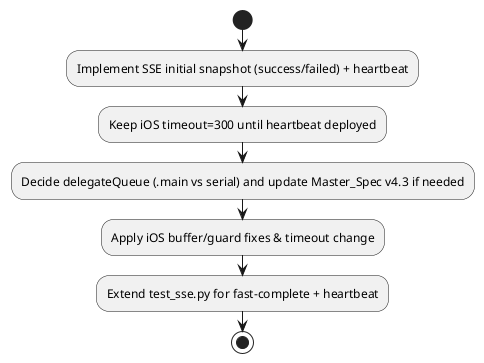

# Phase B Refactor-8: v6 ギャップ修正ブレイクダウン（server/iOSコード照合版）

作成日: 2025-11-23  
目的: v6計画と現行サーバー/ iOSコードの齟齬を是正し、実装手順を明確化する。

## 結論
- `/jobs/{id}/stream` の終端判定が plan 上 "completed" になっており、現行コードの `"success"` を捕捉できない。高速完了時に初期スナップショット後も待機し続けるリスクがある。
- 心拍未実装の状態で iOS の `timeoutInterval` を 60 秒へ短縮すると、長時間ジョブで早期切断が発生し得る。timeout短縮は heartbeat 実装完了後に順序付けする必要がある。
- Master_Spec v4.2 は delegateQueue を `.main` と明記しているが、計画の Option A（delegateQueue=nil）と矛盾。どちらを採用するか決定し、Spec v4.3 へ反映するタスクを必須化すべき。
- テスト計画に `status == "success"` を含む高速完了シナリオがない。回帰テストに初期スナップショット送信と heartbeat 受信を追加する必要がある。

## 根拠（コード照合）
- サーバー終端ステータス: `remote-job-server/job_manager.py:46-101` で成功時は `status="success"`, 失敗時 `status="failed"` を送出。`completed` は存在しない。
- SSEストリーム: `remote-job-server/main.py:529-571` では初期スナップショット未送信。v6計画の早期 return 条件が `completed/failed` のため `success` を見落とす。
- iOS delegateQueue: `iOS_WatchOS/RemotePrompt/RemotePrompt/Services/SSEManager.swift:19-47` で `delegateQueue=nil`（システムBG）。Master_Spec 15.2 では `.main` 指定を修正として要求。
- タイムアウト: 現行コードは `timeoutIntervalForRequest=300`。v6計画 3.4 では 60 秒へ短縮予定だが heartbeat (計画2.2) は未実装。
- テスト: `remote-job-server/tests/test_sse.py` は fast-completion レースや heartbeat を網羅していない。

## 修正ブレイクダウン（チェックリスト）
- [ ] `/jobs/{id}/stream` 初期スナップショット: 早期 return 判定を `status in {"success", "failed"}` に修正。送信 payload も現行ステータス文字列をそのまま使用。
- [ ] Heartbeat 実装完了後に iOS の `timeoutInterval` 短縮を適用（Phase 2→3 の順序を明記）。暫定的に 300 秒を維持する注記を追加。
- [ ] delegateQueue 方針決定: 
  - Option 1: Master_Spec v4.2 に合わせて `.main` へ統一。
  - Option 2: serial `OperationQueue` を採用する場合は Master_Spec v4.3 改訂タスクを計画に追加。
- [ ] SSE回帰テスト拡充: `test_sse.py` に以下を追加
  - fast completion で購読開始前に完了した場合でも初期スナップショットが1件届く
  - heartbeat コメント (`:heartbeat`) が 30s 間隔で届き、接続が維持される
  - `close_stream=True` で必ず `close()` が呼ばれ、サブスクライバ数ログが出る
- [ ] 計画ドキュメント更新: v6 本文に上記修正を追記し、Master_Spec の改訂有無を明記。

## 実施順序（PlantUML）

## 前提・注意
- ステータス名称は現行サーバー実装に従い `queued/running/success/failed` を使用する。
- delegateQueue 方針は必ず仕様書と計画の双方に反映し、iOS実装とテストが同一の前提を共有すること。
- timeout短縮は heartbeat リリース後に行い、順序を誤らないよう計画に明記する。
