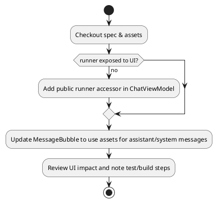

# チャットAIアイコン差し替えプラン (2025-11-20)

## 目的・範囲・完了条件
- 目的: iOSチャット画面のAI側アバターをAssetsに追加されたClaude/Codexアイコンへ差し替える。
- 範囲: `RemotePrompt/Views` のチャット関連UIと必要なViewModelの公開インターフェースのみ。ユーザー側アイコンやサーバー処理は対象外。
- 完了条件:
  - AIメッセージでClaudeタブは`Claude-Code`アイコン、Codexタブは`Codex`アイコンが表示される。
  - 既存レイアウトの崩れがない（28px相当のサイズで表示）。
  - ビルドが通ること（手元でのビルドが困難な場合は差分レビューで確認事項を残す）。

## チェックリスト（進捗管理）
- [x] Docs/Specifications/Master_Specification.mdでiOSチャット仕様を再確認
- [x] Assets.xcassetsに`Claude-Code.imageset`と`Codex.imageset`が存在することを確認
- [x] ChatViewModelからランナー種別をUIが参照できるようにする
- [x] MessageBubbleでAI側アイコンをランナー別の画像に切り替える
- [x] ユーザー側アバターを非表示にしてAI側のみ表示に変更
- [x] 差分を確認し、ビルド/実機確認の要否を整理して報告（今回ビルド未実施・要フォロー）

## ワークフロー (PlantUML)

