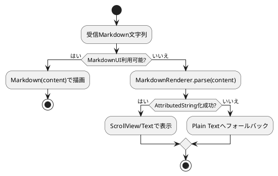

# iOS MarkdownView Fallback Fix Plan

- **作成日**: 2025-11-18
- **担当**: Codex CLI Agent
- **関連仕様**: `Docs/Specifications/Master_Specification.md` §8 iOSアプリ仕様（Markdownレンダリング要件）

## 背景

- iOSシミュレータ起動時に `Views/MarkdownView.swift:22` で `Type '()' cannot conform to 'View'` が発生し、ビルドが停止している。
- `#if canImport(MarkdownUI)` の `#else` ブロックでローカル定数を宣言後に `ScrollView` を返しているが、`var body: some View` で `return` を明示していないため Swift の型推論が `()` を返すと解釈している。
- 仕様上、MarkdownUI が利用できない環境でも AttributedString によるフォールバック描画が必須（`Master_Specification §8.2 レンダリング`）。

## 影響範囲

- `RemotePrompt/Views/MarkdownView.swift`
- `RemotePrompt/Views/MessageBubble.swift`（MarkdownView を埋め込み）
- `RemotePromptTests`（フォールバックロジックの単体テストを追加予定）
- ドキュメント (`Docs/Specifications/Master_Specification.md` の更新記録)

## リスクと前提

- MarkdownUI がビルド対象から除外された場合でも確実にビルドが通る必要がある。
- 失敗時の `print` ではなく、テスト可能な純関数レイヤーでパース結果を管理する。
- 新たに追加するサポートユーティリティは1ファイル 500行以内、責務をMarkdownパース専用に限定する。

## PlantUML ワークフロー

## 作業トラッカー

- [x] 仕様・実装計画確認
- [x] 不具合の原因特定
- [x] MarkdownRendererユーティリティ作成
- [x] MarkdownViewのViewBuilder整備
- [x] 単体テスト (`MarkdownRendererTests`)
- [x] `xcodebuild` によるビルド検証
- [x] `Docs/Specifications/Master_Specification.md` 更新

## 詳細タスク

1. `RemotePrompt/Support/MarkdownRenderer.swift` を新規作成し、`AttributedString` の生成とフォールバックを担う純関数 `render(_:)` を実装する。
2. `MarkdownView` を `#if/#else` 両方で `some View` を明示的に返すようリファクタリングし、`MarkdownRenderer` を利用する。
3. `RemotePromptTests/MarkdownRendererTests.swift` に `XCTestCase` を追加し、以下を検証する。
   - Markdown構文を含む文字列で太字/リンクが `AttributedString` へ変換される。
   - パース失敗時にプレーンテキストへフォールバックする。
   - 空文字列入力時に空の `AttributedString` を返す。
4. `xcodebuild -scheme RemotePrompt -destination "platform=iOS Simulator,name=iPhone 15" build` でビルド検証を実施。
5. 変更内容を `Docs/Specifications/Master_Specification.md` と変更履歴（必要に応じて `Docs/MASTER_SPECIFICATION.md` が存在しない旨を追記）に反映させる。
