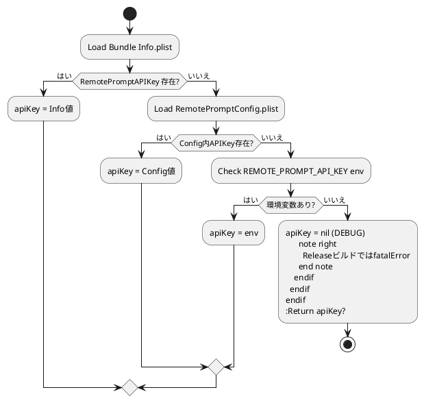

# iOS API Key Configuration Plan

- **作成日**: 2025-11-18
- **担当**: Codex CLI Agent
- **対象**: `RemotePrompt` iOSクライアントのAPIキー取得ロジック

## 背景

- `Constants.apiKey` が起動時に `fatalError("API Key not configured ...")` を呼び出すため、環境変数・Info.plist いずれも未設定の状態ではアプリ/テストが強制終了してしまう。
- 現時点のサーバー仕様では `x-api-key` ヘッダーは将来拡張扱いであり、キー未設定でも致命的エラーにしない運用が望ましい。
- リポジトリには Info.plist が生成式 (GENERATE_INFOPLIST_FILE=YES) のため、手動キー設定が煩雑。
- ローカル開発で安全に値を注入できる `RemotePromptConfig.plist` を追加し、`Constants` から参照できるようにする。

## 影響範囲

- `iOS_WatchOS/RemotePrompt/RemotePrompt/Support/Constants.swift`
- 新規ファイル: `iOS_WatchOS/RemotePrompt/RemotePrompt/Support/RemotePromptConfig.plist`
- ネットワーク層: `APIClient` (Optionalヘッダー対応)
- テスト: `RemotePromptTests`（設定ファイル読込の単体テスト）
- 仕様書: `Docs/Specifications/Master_Specification.md` (APIキー設定手順追記)

## ワークフロー (PlantUML)

## チェックリスト

- [x] 仕様および既存実装の調査
- [x] `RemotePromptConfig.plist` の雛形追加・ターゲット組み込み
- [x] `Constants` の構成値取得ロジック刷新（Config + Info + Env 優先）
- [x] `APIClient` をAPIキーOptional対応に変更
- [x] `Testing` で設定ファイル読み込みテストを実装
- [x] ChatViewModelでAPIキー未設定時にユーザーへ警告
- [x] `xcodebuild` でビルド検証
- [x] `Docs/Specifications/Master_Specification.md` へ設定手順追記

## 変更方針

1. `Support/RemotePromptConfig.plist` を追加し、デフォルトのBaseURL/空APIキーを記述。実キーは開発者がローカルで編集する。
2. `ConfigurationProvider`（新規構造体）を `Support` 配下に作成し、Info.plist → Config.plist → 環境変数 → デフォルトの順で値を取得できるようにする。`Constants` は同プロバイダーを介して `baseURL` / `apiKey` を公開する。
3. `APIClient` は APIキーが `nil` の場合にヘッダーを送信しないよう変更する。
4. テストバンドルに `RemotePromptConfigTests.plist` を追加し、プロバイダーが正しく値を解決することを確認。
5. 仕様書に「Config.plistを編集してAPIキーを設定する」「本番ビルドでは未設定時にビルドを失敗させる」旨を追記。
6. 最後に `xcodebuild -scheme RemotePrompt -destination "platform=iOS Simulator,name=iPhone 17" build` を再実行し、成功を確認。
